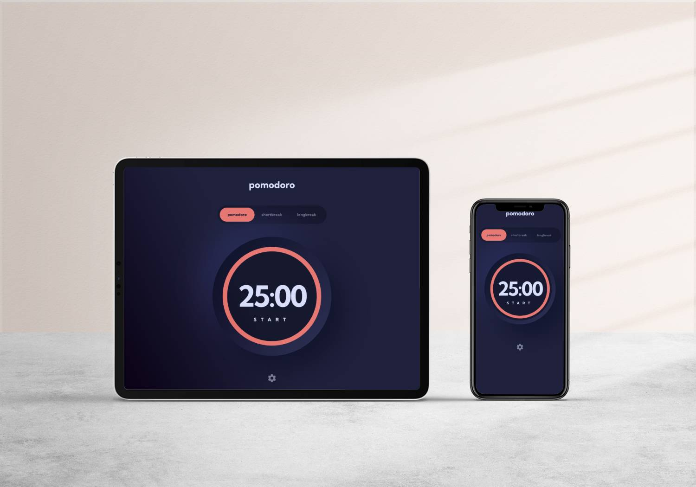

# A Pomodoro-like Timer App 

An app that allows you to set a timer for any duration. Built with React and TypeScript.

## Tech Stack
- React
- TypeScript
- Material-UI

## Features

 - Set a timer for any duration
 - Intuitive interface
 - Customizable theme
 - Responsive design

## Project Setup

In the project directory, you can run:

### `npm start`

Runs the app in the development mode.\
Open [http://localhost:3000](http://localhost:3000) to view it in your browser.

